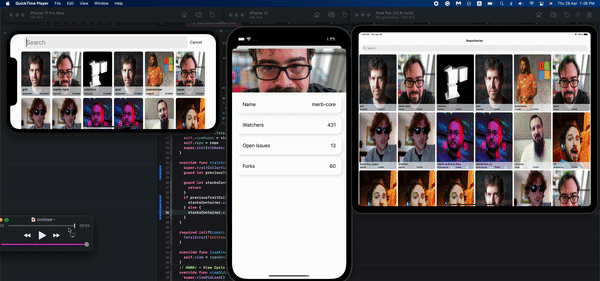
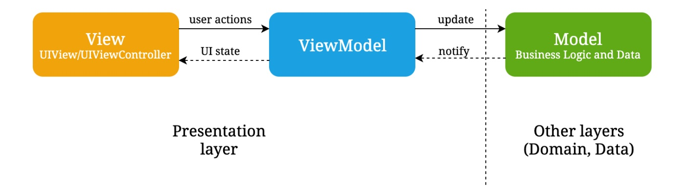

# GithubRepos




## GitHub Repos 💻

GitHubRepos is an iOS Application to list repositories from Github and it's for Robusta's task for iOS Software Engineer hiring process

This document should give you an overview about the project, and how we can improve it

### Goals

while working on this project, to achieve some level of high quality and maintaintbily: 

1. Using MVVM as UI architectural design pattern to decouple UI code.
2. Making a modular app architecture, to enable testability.
3. Having an eye on Cross-Device support (iPad/iPhone/Mac)
4. Embracing Protocol oriented programming.
5. Embracing Value Types instead of references. 
6. Back Supporting until iOS 13
7. Dark/Light mode support.
8. Use Swifty APIs like UIDiffableDataSources, and UIComposableDataSources.
9. Applying Clean architecture principles as much as i can to enable modality.
10. Maintaining code quality by using SwiftLint.

### Architecture


- MVVM
    - View(UIView/UIViewController)
    - ViewModel
    - **Model**
- **Domain Layer**: Entities + Use Cases + Gateway Protocols
- **Data Layer**: Gateway Implementations + API (Network)
- **Presentation Layer**: ViewModels + Views + Navigator + Scene Use Cases
- FlowCoordinator is used for coordinating
- DependencyProvider for supplying depndency

### Implementation Details

In this section i will discuss some of the designs in the code base

- Stack Views are used as much as possible, to make supporting Dynamic data(varying text ...) easier, and also support landscape.
- CocoaPods Keys are used to store GitHub APIKey(outside git, and safer), instead of hardcoding API Keys inside the source code.
- Accessibility identifiers are placed on views, to make UI Testing possible using Early Grey, and, and will leverage from it in accessibility Support :)
- Date formatters are kept static, since creating them is wasteful/costs a lot.
- Network client is implemented using Combine; Combine makes handling errors more important through the pipeline ( unlike Rx, also, it’s native, and faster than Rx)
- NO 3rd party Libraries, i believe that 3rd party libraries shouldn't be used unless there's a huge need for it, and it's mintainable, otherwise it will be a headach, also i'm not intersted into increaing app size.
- ImageLoader with used to load images natively, and it also supports cache
- final is placed for some classe, which should increase overall speed(to Reducing Dynamic Dispatch) 
- ⚠️ Alert: there's some repos with same author, this why some photos are dublicated, it's not an Reusing issue

#### String Matching in Search 🔍
as a requierment, i've made the following function for search
 

```swift
  /// Used to match a string with other one, works as the following
  /// if the query: "123" and receiver is "145623", will return true, because 1, 2, 3 are contained in "145623"
  /// - Parameter query: a string we are searching for inside a string
  /// - Parameter threshold: number of chars that have to be exist in the receiver, default to 2
  /// - Returns: boolean value to indicate if there's a match or not
 private func optimizedMatching(query: String, threshold: Int = 2) -> Bool {
    var dict: [Character: Bool] = [:]
    var charsCount = 0
    /// Time Complexity: O(N) + O(M) = O(M) where M is number of chars in a string, assuming that N the number of chars in a query is going to be less than M
    /// Space Complexity: O(M), taken by dict
    self.forEach { dict[$0] = true }

    for char in query {
      if dict[char] != nil {
        charsCount += 1
        if charsCount >= threshold { return true }
      }
    }

    return false
  }
```
* actually i'm a little bit skeptical about my understaning, did i unserstood it correctly ? my iniail understaind was using contains, but after much reading and concentrating i ended up with the current implemtnion 


### Workarounds

- The provided API doesn’t contain Creation date, to solve this we needed to call Repo URL API, for each repo, to display the date
    - handled like repo image, when the cell is going to be shown, will request the date.
- Pagination is not supported in this api, to support this, the full response of repos were saved in memory, then for each page call, will fetch more 10 items ( using pageIndex)
    - Implemented in the useCase: since i think that it’s an limitation related to the api, and that it’s implemntion detail that other clients shouldn’t care about

### Testability

while writing the code, i’ve put a lot of thinking about how to make it testable, currently the following should be testable 

- UseCases
- Network Service
- Application Coordinators
- App(using FakeAppDelegate)
- UI

Unfortunately, i wan’t able to test all of the following components due to time constraints, so i’ve supplied 4 test cases. 

- test_loadFinishedSuccessfully ( btw, i’ve made a very detailed(one hour!!) tutorial about testing network clients, but didn’t release it yet https://youtu.be/2PqOcFsg7Sk)
- test_loadFailedWithJsonParsingError
- test_FetchRepositoriesPagination
- test_FetchRepositoriesSucceeds

### How to run the project

1. First you need to generate personal token for Github API 
2. Install Cocoapods-keys, it’s used to store API keys outside the repo, and when the application is being compiled, it will be obfuscated inside the source code 
3. Pod install

### Improvements

i believe that for every line of code we write, there’s a better one, this’s why we keep learning and learning, for this project, the areas of improvements where a result of time contrstains, here’ re some of it, let me know if you have more :)

- More Test cases are needed.
- Better handling for Requests Authroizeion, and testing it.
- caching for fetched dates.
- instead of re-fetching the repo when accessing repodetails, we could send RepoDetails which was already fetched to display date
- in landscape, there’s no dismiss button, we should add one 🙂
- supporting more repository details.
- Better handling for app archticture/folder structure

Related Links: 
some of the techniques used here are inspired from the following links:


[https://developer.apple.com/videos/play/wwdc2015/218/](https://www.donnywals.com/using-promises-and-futures-in-combine/)
[https://developer.apple.com/videos/play/wwdc2015/408/](https://www.donnywals.com/using-promises-and-futures-in-combine/)
[https://www.donnywals.com/using-promises-and-futures-in-combine/](https://www.donnywals.com/using-promises-and-futures-in-combine/)

[https://sarunw.com/posts/how-to-use-dateformatter/](https://sarunw.com/posts/how-to-use-dateformatter/)

[https://nshipster.com/secrets/](https://nshipster.com/secrets/)
[https://www.swiftbysundell.com/articles/preventing-views-from-being-model-aware-in-swift/](https://www.swiftbysundell.com/articles/preventing-views-from-being-model-aware-in-swift/)

[https://www.swiftbysundell.com/articles/preventing-views-from-being-model-aware-in-swift/](https://www.swiftbysundell.com/articles/preventing-views-from-being-model-aware-in-swift/)

[https://www.wwt.com/article/synchronous-network-calls-with-combine](https://www.wwt.com/article/synchronous-network-calls-with-combine)

Please let me know your feedback, thank you all for reading this ;) 
